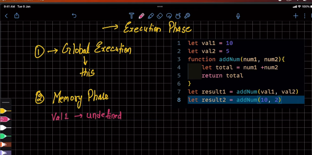
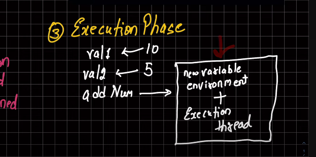
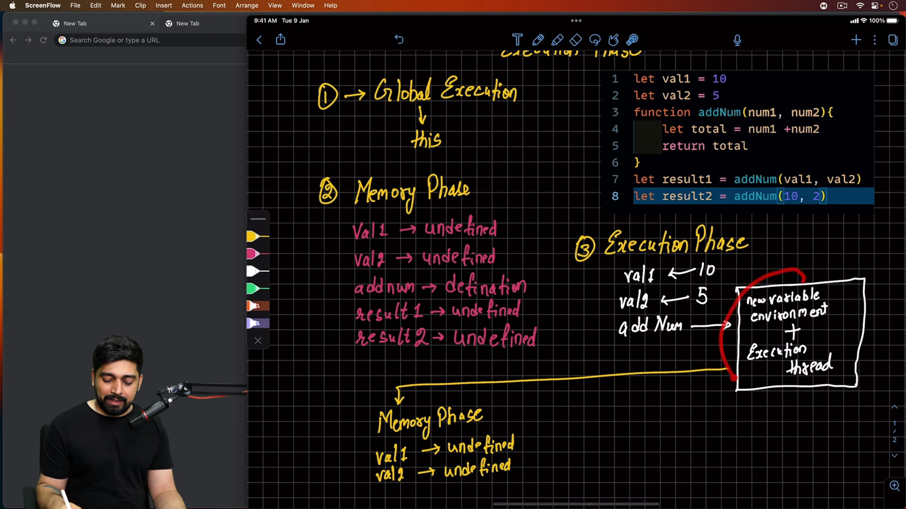
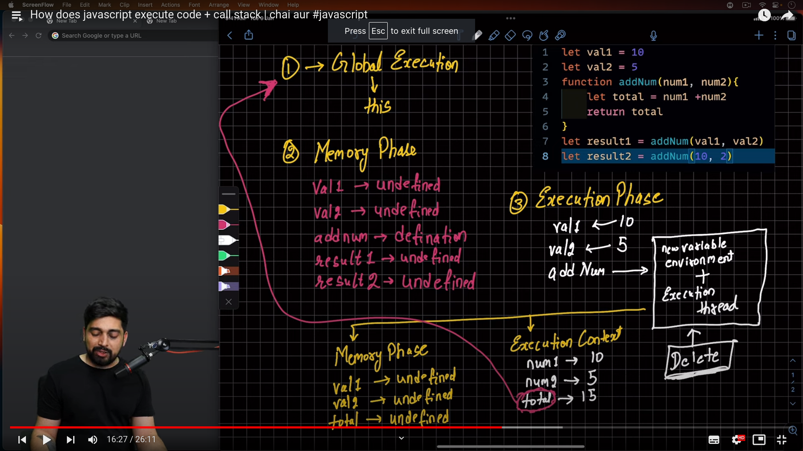
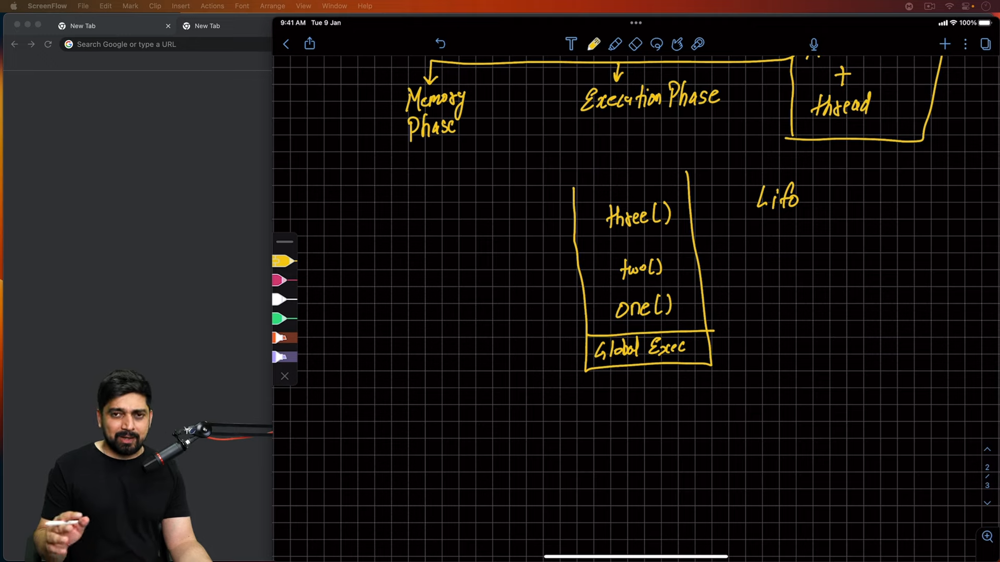

# Javascript Execution and Code Stack

### Javascript Execution Context

 Global execution coontext referes to the this keywords

 Browser ka Global execution context window object hota hai

- Javascript is single threaded language
- Javascript code executes in a single thread. Sequentialy, one after another.

There are two types of Execution contexts:

- 1 Global Execution Context
- 2 Function Execution Context
- 3 Eval Execution Context

First Phase is Memory Creation Phase


In Memory Creation Phase location assign to the variables and declared variables in memory creation phase -> Memory creation phase
  

  In Above Example 
  Firstly In Memory creation phase 

  1) Memory Phase

  val1 = undefined
  val2 = undefined
  addNum() = Function definition
  resul1  = undefined
  result2 = undefined

Above is First Cycle Just Memory Created

1) Execution Phase
     val1 = 10
     val2 = 5
     addNum = Function execution in which result1 variables so it creates and it creates new Execution context for function execution

     

     


   After Performing the above code
  It will return a result which is 15 which is passed to the result1 variables and also it returns the variables to the Global exection context

  After completing the above function execution that context will be destroyed

  

  so resul1 get value of function execution

So In Global Execution context we reach to the final line and which will repeat the above steps creating separate execution context  for each call of addNum() function and assign variables to undefined the memory creation phase and then execution phase it will perform the code in that function execution context.


## <i> CALL STACK </i>
     


``` javascript
     function One(){
           console.log("One Function"); -- First Will Executed
           Two();

     }
     function Two(){
        console.log("Two Function");  -- second will executed
        Three();
     }

     function Three(){
        console.log("Three Function"); -- Third will e
        One();
     }

     One();

```


