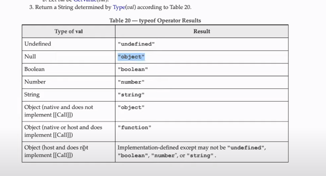

# DATA TYPES 2

Categorization of data is depends on how the data is stored in memory and how it is accessed.

On these basis, data types are categorized into two types:

- Primitive Data Types
- Non-primitive Data Types (Reference Data Types)

Primitive Data Types: - Number - BigInt - String - Boolean - null - undefined - Symbol

- Reference Data Types
  - Arrays
  - Objects
  - Functions


 ## IQ 

 Is Javascript statically typed or Dynamically typed Language ?


 # Refrence Data Types

  * Arrays
  * Objects
  * Functions

  ## Arrays

  Arrays are used to store multiple values in a single variable.

  ## Objects

  Objects are used to store collections of data and more complex entities.

  ## Functions

  Functions are used to define reusable code blocks.

 
 ### typeof Operator

   ``` javascript

        typeof(null) //

   ```

   <!-- How to add image in the md file -->

()

   ``` javascript

        const test = function(){
            console.log("Hello world");
        }
        console.log(typeof test); //

   ```


   1.Number:
        Represents both integers and floating-point numbers.
        Typical Range: -9,007,199,254,740,992 (-2^53) to 9,007,199,254,740,992 (2^53) inclusive.
        Smallest Increment: 2^(-52).

    2.String:
        Represents a sequence of characters.
        No specific range limit, but practical limits depend on memory and system resources.

    3.Boolean:
        Represents true or false.
        Only two possible values: true and false.

    4.Undefined:
        Represents a variable that has been declared but hasn't been assigned a value.
        It has only one possible value: undefined.

    5.Null:
        Represents the intentional absence of any object or value.
        It has only one possible value: null.

    6.Symbol (ES6):
        Represents a unique and immutable value.
        No specific range limit.

    7.BigInt (ES11):
        Represents large integers that cannot be represented by the Number type.
        The range is practically unlimited and depends on available memory.


* Premitive Datatypes

                  Type                                   typeof

i)             Number                               number
ii)            String                                   string
iii)           Boolean                               boolean
iv)           Bigint                                   bigint
v)            Symbol                                symbol
vi)           Null                                      object
vii)          Undefined                           undefined


* Non-Premitive OR Referance OR Object datatype

                  Type                                   typeof

i)               Object                                object
ii)              Array                                  object
iii)             Function                            function(object)