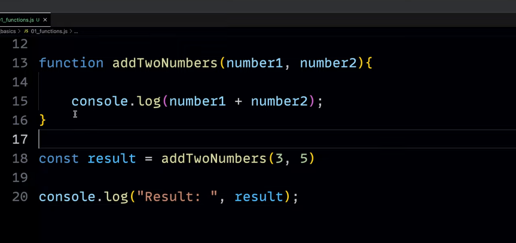
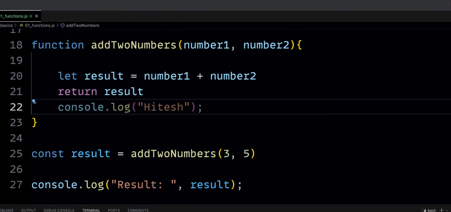
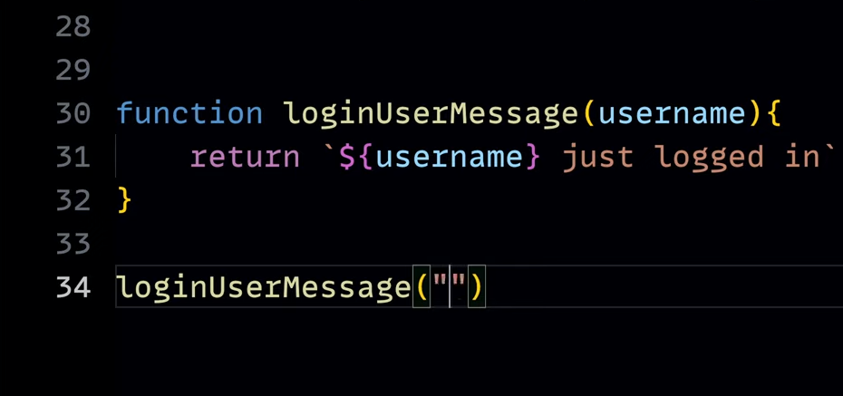
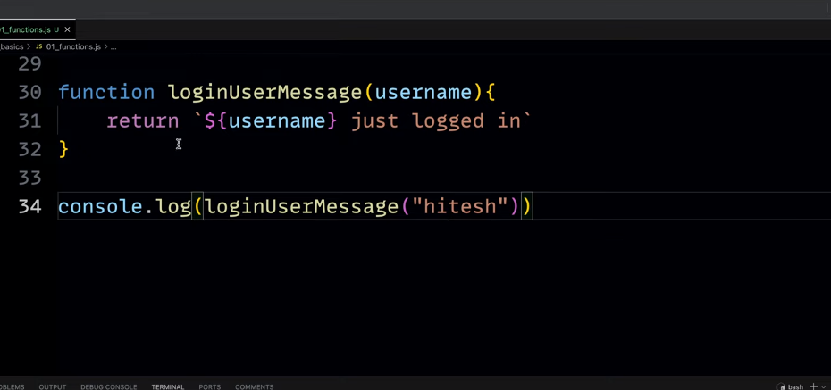
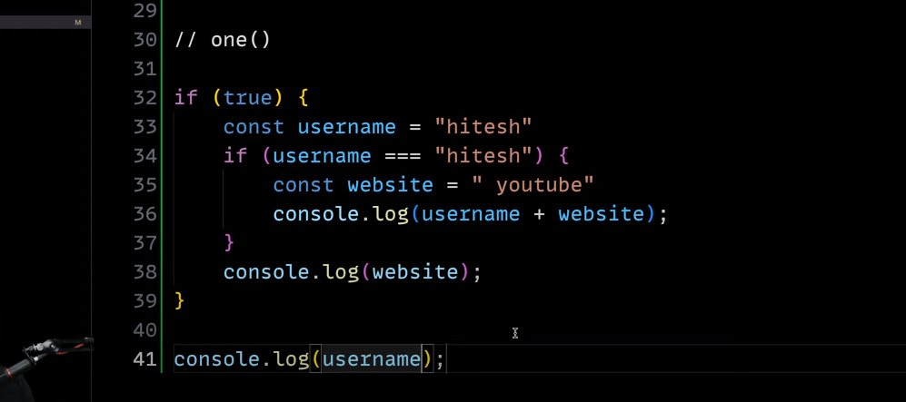

### Function Syntax

function functionName() {
// Code
}

- functionName(); -> As soon as you put the paranthesis it will call the function.

### Parameters and Arguments

    Parameters are the variables that are defined in the function definition.
    Arguments are the values that are passed to the function when it is called.

    call -> Arguments
    definition -> Parameters










<b> When you pass an array as a parameter, if the function changes any of the array's values, that change is visible outside the function, </b>

Functions must be in scope when they are called, but the function declaration can be hoisted (appear below the call in the code)

``` javascript
    console.log(square(5)); // 25

function square(n) {
  return n * n;
}
   ```

   Function hoisting only works with function declarations — not with function expressions

   ``` javascript
      console.log(square(5)); // ReferenceError: Cannot access 'square' before initialization
const square = function (n) {
  return n * n;
};
```


The inner function forms a closure: the inner function can use the arguments and variables of the outer function, while the outer function cannot use the arguments and variables of the inner function.

JavaScript allows for the nesting of functions and grants the inner function full access to all the variables and functions defined inside the outer function (and all other variables and functions that the outer function has access to).

However, the outer function does not have access to the variables and functions defined inside the inner function. This provides a sort of encapsulation for the variables of the inner function.