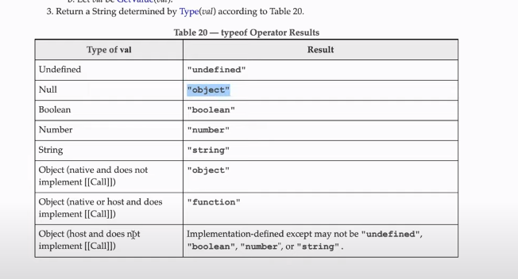
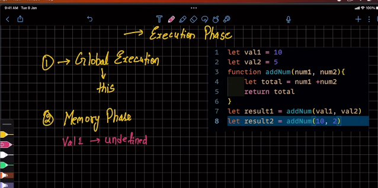

# Memory Management in JS

- Primitive data types used by the Stack
- Non Primitive data types uses the Heap Memory

```javascript
let oldName = "Shubham";
let newName = "Hrishi";

newName = oldName;

newName = "Ramesh";

console.log(oldName, newName); // Shubham Ramesh
```

  (!)

  
