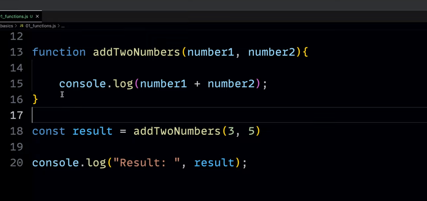
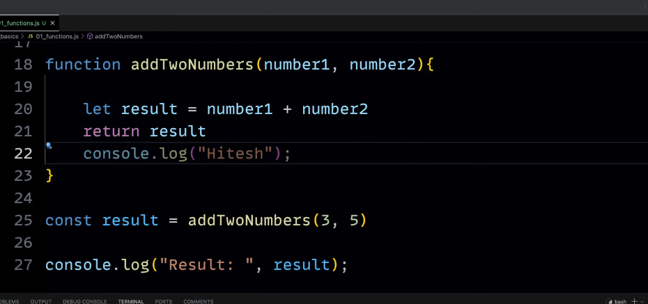
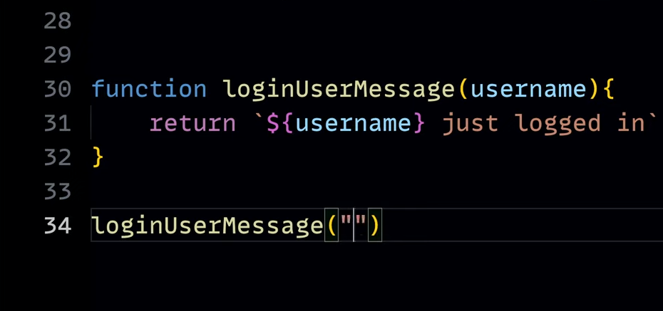
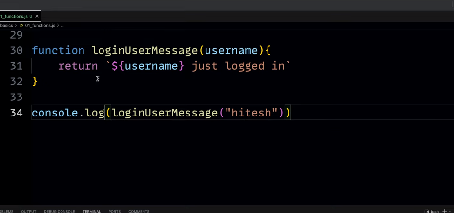
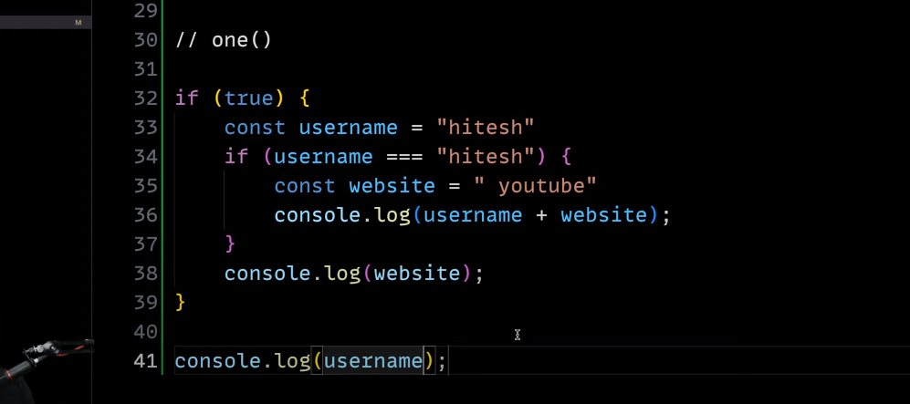

### Function Syntax

function functionName() {
// Code
}

- functionName(); -> As soon as you put the paranthesis it will call the function.

### Parameters and Arguments

    Parameters are the variables that are defined in the function definition.
    Arguments are the values that are passed to the function when it is called.

    call -> Arguments
    definition -> Parameters

